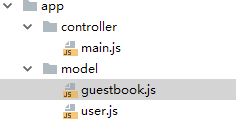

## Data access of k framework

k offer a very easy way to use MySQL, let's look into it.

### Data Model

Data model is the beginning of all data access method.

Use the scaffold, the command ```k m [model]```.

```
$ cd ./home

$ k m guestbook

generated: /home/app/model/guestbook.js
```

ok, we got the guestbook model file:



the file contents:

```
module.exports = function (Model) {
    class guestbook extends Model{
    }
    return guestbook
}
```


### the ORM


#### findAll() find many records by conditions

**Usage** ```findAll(conditions, sort, fields = '*', limit)```

**Arguments**

1. ```conditions```, key-value object format, refer to the condition for search in the database table. There are two formats :
    - simple key-value object, that is **AND** logic for the condition. Such as ```{'id' : 100}``` means ```id=100``` and ```{'age':18, 'gender':'male'}``` means ```age=18 and gender=male```.
    - also there is a special key ```where```. When the condition of key-value has a ```where``` key, that means **WHERE AND MAPPING** logic. Such as ```{'where':'age > :age or gender = :gender', 'age' : 18, 'gender':'male'}``` that means ```where age > 18 or gender = 'male'``` .

    The ```where``` key can find records of ``` > < or like``` conditions etc.

    Default: null, means get all records, with no the condition.

    Example:

    Type|Code
    ---|---
    SQL | ```SELECT * FROM students WHERE score > 90 AND ( classname = 'class1' OR classname = 'class2' );```
    findAll | ```findAll({'where':'score > :score AND ( classname = :c1 OR classname = :c2', 'score':90, 'c1':'class1', 'c2':'class2'}) ```

    Type|Code
    ---|---
    SQL | ```SELECT * FROM records WHERE ip like "218.26.35.%";```
    findAll | ```findAll({'where':'ip like :ip', 'ip':"218.26.35.%"}) ```

2. ```sort```, string format, refer to the sort of the records being search. In SQL, that is the ```ORDER BY``` field.

    Default: null, means no ```ORDER BY```.

    Example:

    Type|Code
    ---|---
    SQL | ```SELECT * FROM  spgb_gb ORDER BY post_time ASC;```
    findAll | ```findAll(null, "post_time ASC") ```

    Type|Code
    ---|---
    SQL | ```SELECT * FROM  spgb_gb ORDER BY post_time DESC;```
    findAll | ```findAll(null, "post_time DESC") ```

    Type|Code
    ---|---
    SQL | ```SELECT * FROM spgb_gb WHERE name = 'jake' ORDER BY post_time ASC, replay DESC;```
    findAll | ```findAll({'name':'jake'}, "post_time ASC, replay DESC") ```

3. ```fields```, string format, refer to witch fields of result would get back. The value is name of fields, separated by commas.

    Default: * , means get all fields.

    Example:

    Type|Code
    ---|---
    SQL | ```SELECT gid, name, contents FROM spgb_gb;```
    findAll | ```findAll(null, null, "gid, name, contents") ```

    Type|Code
    ---|---
    SQL | ```SELECT spgb_gb.gid, spgb_gd.name, spgb_gb.contents FROM spgb_gb;```
    findAll | ```findAll(null, null, "spgb_gb.gid, spgb_gd.name, spgb_gb.contents") ```

4. ```limit```, has tow format string and array, refer to the get how many record in the result.

    Default: null, means get all the result by the condition.

    when ```limit``` is string format, it looks something like ```10, 20```, just as the ```LIMIT 10, 20``` in SQL.

    Example:

    Type|Code
    ---|---
    SQL | ```SELECT * FROM spgb_gb LIMIT 10;```
    findAll | ```findAll(null, null, "*", "10") ```

    Type|Code
    ---|---
    SQL | ```SELECT * FROM spgb_gb LIMIT 10, 20;```
    findAll | ```findAll(null, null, "*", "10, 20") ```

    when ```limit``` comes as a array, such as ```[1, 10, 10]```, that is the Pagination.

    ``` limit = [current_page_number, record_sum_in_a_page, page_number_collapsing```

    Type|Code
    ---|---
    SQL | ```SELECT * FROM spgb_gb LIMIT 10;```
    findAll | ```findAll(null, null, "*", [1, 10]) ```
    means | current page is 1, get 10 records in a page

    Then you can use the obj.page() to get the Pagination data.

    **Pagination data**

    field | mean
    --- | ---
    total_count | the total sum of the records
    page_size | how many records in a page
    total_page | how many pages
    first_page | page number of first page
    prev_page | page number of previous page
    next_page | page number of next page
    last_page | page number of last page
    current_page | the current page number
    all_pages | all page numbers
    offset | search offset, as the ```LIMIT``` first arguments in SQL
    limit | search count, as the ```LIMIT``` second arguments in SQL

#### find() find one records by conditions

**Usage** ```find(conditions, sort, fields = '*')```

**Arguments**

as the first three arguments of findAll(), conditions, sort, fields.

so you can find out the ```find()``` as ```LIMIT 1 of the findAll()```, but the result comes as a map.

#### create() insert a record

**Usage** ```create(row)```

**Arguments**

1. ```row```, a map value of fields ans values. the fields is map to the table field name. If the table fields is not exists in the ```row```, that will be the default value of the SQL.

    Example:

    Type|Code
    ---|---
    SQL | ```INSERT INTO spgb_gb (field1, field2,...) VALUES (value1, value2,...);```
    findAll | ```create(["field1":"value1", "field2":"value2", ...])```


#### update() update records by condition

**Usage** ```update(conditions, row) ```

**Arguments**

1. ```conditions```, same as the ```findAll()``` conditions above.

2. ```row```, same as the ```create()``` row above, refer to fields to be update a new value.


    Example:

    Type|Code
    ---|---
    SQL | ```UPDATE table SET FirstName = 'Fred' WHERE LastName = 'Wilson' ;```
    findAll | ```update(["LastName":"Wilson"], ["FirstName":"Fred"])```


#### delete() delete records by conditions

**Usage** ```delete(conditions)```

**Arguments**

1. ```conditions```, same as the ```findAll()``` conditions above.

    Example:

    Type|Code
    ---|---
    SQL | ```DELETE FROM table WHERE LastName = 'Wilson' ```
    findAll | ```delete(["LastName":"Wilson"])```


#### findCount() get the records count by conditions

**Usage** ```findCount(conditions)```

**Arguments**

1. ```conditions```, same as the ```findAll()``` conditions above.

    Example:

    Type|Code
    ---|---
    SQL | ```SELECT count(*) FROM table WHERE LastName = 'Wilson' ```
    findAll | ```findAll(["LastName":"Wilson"])```


#### incr() increase numeric fields by condition

**Usage** ```incr(conditions, field, optval = 1)```

**Arguments**

1. ```conditions```, same as the ```findAll()``` conditions above.

2. ```field```, string format, refer to numeric field to be increased.

3. ```optval```, number format, default 1, refer to increase the field by the value.

    Example:

    Type|Code
    ---|---
    SQL | ```UPDATE table SET Money = Money + 100 WHERE LastName = 'Wilson' ;```
    findAll | ```incr(["LastName":"Wilson"], "Money", 100)```

#### decr() decrease numeric fields by condition

**Usage** ```decr(conditions, field, optval = 1)```

the opposite of incr().

#### dumpSql() get the executed SQLs

**Usage** ```dumpSql()```

#### sql() get the last executed SQL

**Usage** ```sql()```

#### page() get the Pagination data of findAll()

**Usage** ```page()```

see findAll() above.

#### query() get records by SQL

**Usage** ```query(_sql, _values)```

**Arguments**

1. ```_sql```, the SQL.

2. ```_values```, key-value format, replace the values of the keys in the SQL.

#### execute() execute the SQL

**Usage** ```execute(_sql, _values)```

**Arguments**

1. ```_sql```, the SQL.

2. ```_values```, key-value format, replace the values of the keys in the SQL.

