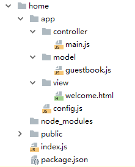
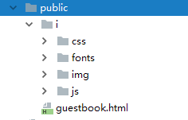
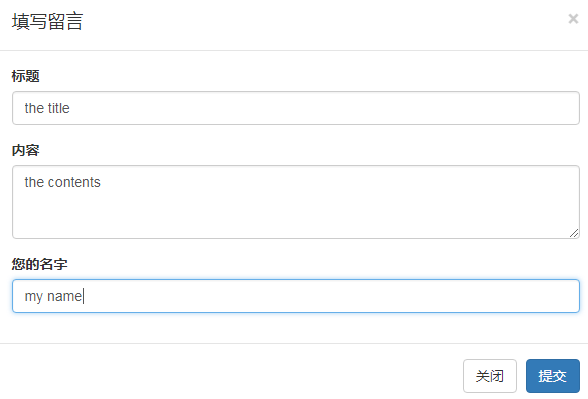
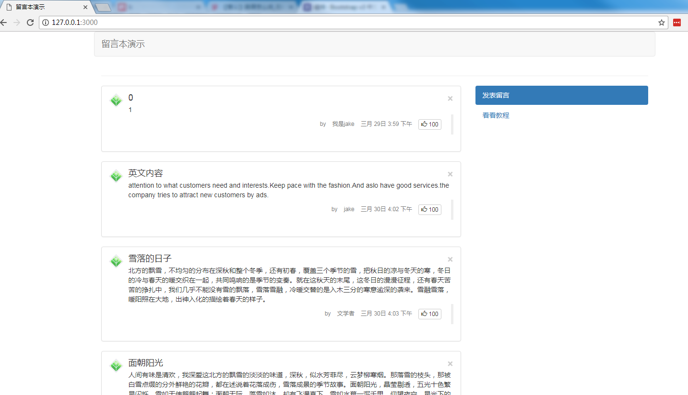
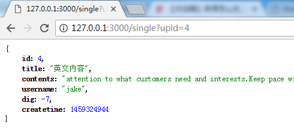

## Prepare the Hello world

**Requirement**

nodejs > 7.1

**Install**

```npm install k -g```

**Scaffold**

k has some quickly way to create a app, by the scaffold.
Here we used the ```k new [app]```.

```
$ cd ./home

$ k new appname

$ npm install

(wait for a while and completed)
```
Then we can see the files.



**Run**

Run the ```node index.js``` could see the ```hello world ``` on http://127.0.0.1:3000 .

**Modify some word**

Open the ```/home/app/controller/main.js``` , you can see the code below:

```
class main {
    async index(ctx){
        //let obj = ctx.model('user')
        await ctx.render('welcome', {'welcome' : "hello world!"})
    }
}
module.exports = main
```

Now we modify something:

```
class main {
    async index(ctx){
        //let obj = ctx.model('user')
        await ctx.render('welcome', {'welcome' : "welcome to my app!"})
    }
}
module.exports = main
```

```Ctrl+c```  the previous command and re-run the ```node index.js```.

so, we can see ```welcome to my app!``` on the http://127.0.0.1:3000 .

## Create a guestbook in 10 minute

### Prepare the Pages

Begin, we prepare a zip of the HTML pages and the style etc.

[Download the pages for guestbook](img/quick-turorial-pages.zip)

> In real world develop job, there would offered some semi-finished pages for you, and you can start up quickly.
>
> In open source world, the Bootstrap is also a best tools for you to create the pages quickly.

Upzip the pages to the ```/home/public/``` dir:



Move the ```guestbook.html``` to the ```/home/app/view```


### Prepare the Database

> we suppose you have some web development skills, so you can make a MySQL database to use.

First create a database for the guestbook.

```
CREATE TABLE `guestbook` (
    `id` INT(11) NOT NULL AUTO_INCREMENT ,
    `title` VARCHAR(50),
    `contents` VARCHAR(200),
    `username` VARCHAR(20),
    `createtime` INT(11),
    PRIMARY KEY (`id`)
) ENGINE = InnoDB CHARACTER SET utf8 COLLATE utf8_general_ci;
```

Config the ```/home/app/config.js``` with the database info.

```
const lodash = require('lodash')
const env = process.env.NODE_ENV || 'development'
let config = {
    'default': {
        'router_map': {
            '/index.html': 'main/index',
            '/': 'main/index',
        },
        'mysql' : {
            host     : 'localhost', // database host address
            user     : 'root',      // database username
            password : '123456',    // database password
            database : 'test'       // database name
        },
        'view_opts' : {
            'map' : {
                html: 'twig'
            }
        },
    },
    'development': {},
    'production': {}
}
module.exports = lodash.assign(config.default, config[env], {'default': {'env': env}})
```

### Prepare the Model

Use the scaffold, the command ```k m [model]```.

```
$ cd ./home

$ k m guestbook

generated: /home/app/model/guestbook.js
```

ok, we got the guestbook model file:


the file contents:

```
module.exports = function (Model) {
    class guestbook extends Model{
    }
    return guestbook
}
```

### Write post before show the guestbook

We should do with the write the post in guestbook, before we see it.

Open the template file ```/home/app/view/guestbook.html```, find the ```form``` in about line 110:
```
<form method="POST" action="#">
```

modify to :
```
<form method="POST" action="/write">
```

now the form will post to the url ```/write```

We set the url in the ```/home/app/config.js```, so it can directing to a action(main/write).
```
        'router_map': {
            '/index.html': 'main/index',
            '/write' : 'main/write',
            '/': 'main/index',
        },
```
Open the controller ```/home/app/controller/main.js```, add a action:

```

class main {
    async index(ctx){
        //let obj = ctx.model('user')
        await ctx.render('welcome', {'welcome' : "welcome to my app!"})
    }

    async write(ctx) {
        console.log(ctx.request.body)
    }
}
module.exports = main
```

by the config and the write() method, we can see the data posted by the form and received by the write() method.

the ```console.log(ctx.request.body)``` show the posted data.

when post the form,



the console will display:

```
$ node index.js
{ title: 'the title',
  contents: 'the contents',
  username: 'my name' }
```

Next we write the data to the database:

```
   async write(ctx) {
        //console.log(ctx.request.body)
        let newrow = {
            "title": ctx.request.body.title,
            "contents": ctx.request.body.contents,
            "username": ctx.request.body.username,
            "createtime": moment().format('X')
        }
        //console.log(newrow)
        let guestbook = ctx.model('guestbook')
        let newid = await guestbook.create(newrow)
        if (newid) {

            ctx.redirect('/index.html')
        } else {
            ctx.throw(502)
        }
    }
```

The ```createtime``` we hoped to show in a pretty format, so we store the time in timestamp form, use the ```moment``` lib.

1. add a ```dependencies``` in the ```/home/package.json```,

```
  "dependencies": {
    "k": "latest",
    "koa": "^2.3.0",
    "moment": "^2.19.2",
    "twig": "^1.10.5"
  }
```

2. require the ```moment``` in the ```/home/app/controller/main.js```

```
const moment = require("moment")

class main {
...
```

3. then we can use the ```moment().format('X')``` to get the timestamp for now.

**Let's see the code ```main.js``` above:**

1. we format a newrow object, and it's keys the same with the database field names. And it's values comes from the ```ctx.request.body.[name]```, that is the HTML form input field name. For example the form data :
    ```<input type="text" name="title" ...>``` is posted to the ```ctx.request.body.title```.
2. then ```let guestbook = ctx.model('guestbook')```, we create a model named ```guestbook```. The ```ctx.model([model name])``` is a quick helper for developer to create a db object.
3. ```let newid = await guestbook.create(newrow)```, run the ```create``` of the model, and receive the new increase id ```newid```.
4. if the ```newid``` exists, we redirect the page to the front page: ```ctx.redirect('/index.html')```; if not, simply throw a 502 error.

you can post some new rows for next.

### Display the data on the front page

Let's focus on the ```index()``` of ```main.js```, changed it to:

```
    async index(ctx) {
        let guestbook = ctx.model('guestbook')
        let records = await guestbook.findAll()
        moment.locale('zh-cn')
        if (records) {
            for (let r in records) {
                records[r]['createtime'] = moment(records[r]['createtime'], "X").format('MMMM Do h:mm A')
            }
        }
        //console.log(records)
        await ctx.render('guestbook', {'records': records})
    }
```

**In the index() method:**

1. create the guestbook model.
2. get all the data from the database table, ```let records = await guestbook.findAll()```, by using the findAll(), witch is a function belongs to the model.
3. ```moment.locale('zh-cn')``` set the time field for locale.
4. if the records exists, then for each the ```createtime``` field to change to pretty format.
5. then render the ```guestbook``` template with records, ```ctx.render('guestbook', {'records': records})```.

**Open the ```/home/app/view/guestbook.html```, in line 26, modify:**

```
            <div class="col-md-8">
                
                <div class="panel panel-default">
                    <div class="panel-body">
                        <div class="media">
                            <div class="media-left">
                                <a href="#">
                                    
                                </a>
                            </div>
                            <div class="media-body">
                                <h4 class="media-heading">{{record.title}}<button type="button" class="close" aria-label="Close"><span aria-hidden="true">&times;</span></button></h4>
                                {{record.contents}}

                                <blockquote class="blockquote-reverse small">
                                    <ul class="list-inline text-muted">

                                        <li>by</li>
                                        <li>{{record.username}}</li>
                                        <li>{{record.createtime}}</li>
                                        <li>
                                            <button type="button" class="btn btn-default btn-xs"><span class="glyphicon glyphicon-thumbs-up" aria-hidden="true"></span> 100</button>
                                        </li>
                                    </ul>
                                </blockquote>
                            </div>
                        </div>
                    </div>
                </div>
                
```

See the code above:

1. Use the ```twig``` loop statement ```for``` to expand the ```records``` from ```main.js```.
```


...Loop the records data...


```
2. Within the loop, replace some field to ```{{Variable}}```, it means to show the Variable here.

Name | Meaning
---|---
{{record.title}}|the title
{{record.contents}}|the post content
{{record.username}}|username
{{record.createtime}}| the time post is create, format by moment

3. Re-run the ```node index.js```, so you can see the guestbook:



By now, we finish a guestbook simply.

## Data CRUD and Ajax

> [CRUD](https://en.wikipedia.org/wiki/Create,_read,_update_and_delete) is the four basic functions of Database.
> [JQuery](https://zh.wikipedia.org/wiki/JQuery) jQuery's syntax is designed to make it easier to navigate a document, select DOM elements, create animations, handle events, and develop Ajax applications.

### Show the single post

First of all, we should create a new controller file by the scaffold, use ```k c [controllername]```

```
$ cd ./home

$ k c single

generated: /home/app/controller/single.js
```

So, add a route rule ```'/single' : 'single/index',``` in ```/home/app/config.js``` :

```
        'router_map': {
            '/index.html': 'main/index',
            '/write' : 'main/write',
            '/single' : 'single/index',
            '/': 'main/index',
        },
```

and now visit the http://127.0.0.1:3000/single will go to the ```single``` controller.

Open the ```/home/app/controller/single.js```, modify:

```
class single {
    async index(ctx){
        let condition = {"id" : ctx.request.query.upid}
        let guestbook = ctx.model('guestbook')

        let result = await guestbook.find(condition)
        console.log(result)
        console.log(guestbook.dumpSql())
    }
}
module.exports = single
```

Here we ignore the display, instead to see the data.

1. format the ```condition```, it's ```id``` mapping to   the GET parameter ```ctx.request.query.upid```, that meaning we will find the condition is field ```id``` equal the ```ctx.request.query.upid``` .
2. ```let guestbook = ctx.model('guestbook')``` get model as above.
3. next we ```find``` the condition, get a result, which show in the console.log().
4. re-run ```node index.js``` , and visit http://127.0.0.1:3000/single?upid=1 , the ```upid``` is some value exists in the database table.
5. ```console.log(guestbook.dumpSql())``` can see the executed SQL which is, very useful function.

now we get a single record in the table, which find by ```id```.

> let's see the ```main/index``` has a ```findAll()```, and now ```single/index``` has a ```find()```, there are some  different.

Addition we modify ```single.js``` hoping to show the data on browser, by json format.

> [json](https://zh.wikipedia.org/wiki/JSON) JavaScript Object Notation. It is a very common data format used for asynchronous browser–server communication, including as a replacement for XML in some AJAX-style systems.

```
class single {
    async index(ctx){
        let condition = {"id" : ctx.request.query.upid}
        let guestbook = ctx.model('guestbook')
        let result = await guestbook.find(condition)

        if ( result ){
            ctx.set('Content-Type', 'application/json')
            ctx.body = JSON.stringify(result)
        }else{
            ctx.throw(404)
        }
    }
}
module.exports = single
```

1. when we get the ```result```, check if it had a data, if not throw a ```404 NOT FOUND``` error to browser.
2. if ```result``` got data, so change the content-type to json, then send json data by ```ctx.body```

now re-run and see on browser:



Next, we modify the ```guestbook.html```, on line about 116:

```
    <div class="modal fade" id="showModal" tabindex="-1" role="dialog" aria-labelledby="myModalLabel">
        <div class="modal-dialog" role="document">
            <div class="modal-content">
                <div class="modal-header">
                    <button type="button" class="close" data-dismiss="modal" aria-label="Close"><span aria-hidden="true">&times;</span></button>
                    <h4 class="modal-title" id="show_title"></h4>
                </div>
                <div class="modal-body">
                    <p id="show_contents"></p>
                    <blockquote class="blockquote-reverse small">
                        <ul class="list-inline text-muted">

                            <li>by</li>
                            <li id="show_username"></li>
                            <li id="show_createtime"></li>
                            <li>
                                <button type="button" class="btn btn-default btn-xs"><span class="glyphicon glyphicon-thumbs-up" aria-hidden="true"></span> 100</button>
                            </li>
                        </ul>
                    </blockquote>
                </div>
                <div class="modal-footer">
                    <button type="button" class="btn btn-default" data-dismiss="modal">关闭</button>
                </div>
            </div>
        </div>
    </div>
    <script>
        function showmsg(id){
            $.getJSON("/single", { 'upid': id }, function(json){
                $("#show_title").html(json.title);
                $("#show_contents").html(json.contents);
                $("#show_username").html(json.username);
                $("#show_createtime").html(json.createtime);
                $('#showModal').modal('show');
            });
        }
    </script>
```

1. modify the positions of fields, for example ```<li id="show_username"></li>``` is to show the ```username``` field.
2. create a javascript function ```showmsg()```, it can send a request to ```/single``` add upid, then receive the json in callback function.
3. the callback function ```function(json){}``` can execute in request return, then change the positions.

Also there are a job to do, find and change :

```
<h4 class="media-heading">{{record.title}}<button type="button" class="close" aria-label="Close"><span aria-hidden="true">&times;</span></button></h4>
```
 to

 ```
 <h4 class="media-heading"><a href="javascript:void(0);" onclick="showmsg({{record.id}})">{{record.title}}</a><button type="button" class="close" aria-label="Close"><span aria-hidden="true">&times;</span></button></h4>
```

1. every title position we added a ```onclick``` event, it can raise the ```showmsg()``` function.
2. As the same time we bring the id to ```showmsg()``` .

Ok, now re-run and visit, click on every post title, we can see the Ajax data.

### Like 


